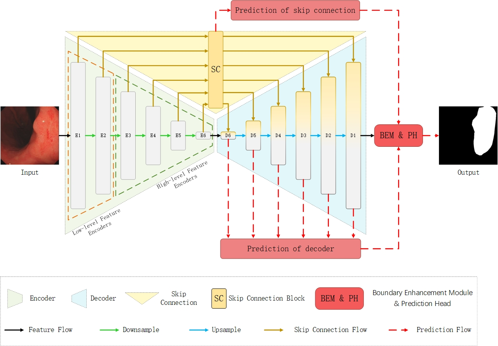
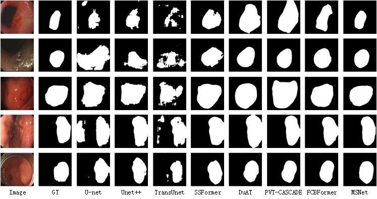
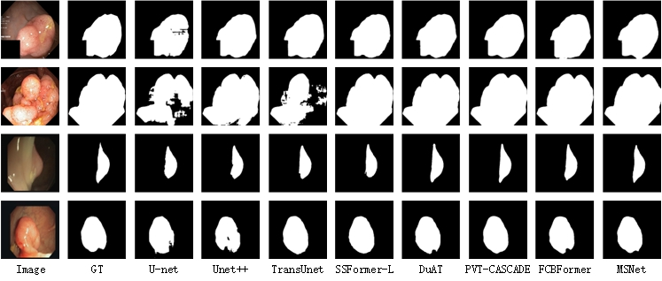

# MSNet

Official code repository for: MSNet：A novel network with comprehensive multi-scale feature integration for gastric cancer lesion segmentation

## 1. Overview

### 1.1 Abstract

Accurate segmentation of gastric cancer lesions is crucial for early diagnosis and treatment of gastric cancer. Due to the variations in appearance and the issue of indistinct boundaries of gastric cancer lesions, achieving precise automatic segmentation remains challenging. Therefore, this paper proposes a novel CNN-Transformer hybrid network, MSNet, which comprehensively utilizes multi-scale features. It aims to improve the segmentation accuracy of gastric cancer lesions by enhancing its ability to capture multi-scale features and distinguish boundaries. Firstly, a multi-scale perception module (MSPM) is designed specifically to capture and enhance multi-scale features, employing multiple pathways with stripe convolutions of various kernel sizes. Secondly, to enhance the model's ability to identify target boundaries, we propose an improved dual feature pyramid (IDFP) strategy to obtain multi-scale prediction maps from various pathways and stages, thereby aggregating multi-scale features. Thirdly, to refine the network's recognition of target boundaries, we future introduce a Boundary Enhancement Module (BEM), which integrates the multi-scale prediction maps obtained from IDFP with the final output of the decoder. This integration aims to mitigate spatial information loss caused by consecutive downsampling and upsampling operations, thereby achieving more precise segmentation outcomes. Extensive experiments are conducted on the privately collected gastric endoscopy dataset and five publicly available colonoscopy polyp datasets, aiming to assess the effectiveness and generalization of the proposed method. Results demonstrate that the proposed network achieves superior performance compared to other state-of-the-art methods in terms of accuracy.
### 1.2 Architecture

<p align="center">
	 <br />
	<em>
		Figure 1: Illustration of the proposed MSNet architecture
	</em>
</p>

### 1.3 Qualitative results

<p align="center">
	 <br />
	<em>
		Figure 2: Quantitative results of different methods on the gastroscopy dataset
	</em>
</p>

<p align="center">
	 <br />
	<em>
		Figure 3: Visualization results from different methods on Kvasir-SEG and CVC-ClinicDB datasets, the first two lines show the prediction results on Kvasir-SEG dataset, and the last two lines show the prediction results on CVC-ClinicDB dataset.
	</em>
</p>

## 2. Usage

### 2.1 Preparation

+ Create and activate virtual environment:

```
python3 -m venv ~/MSNet-env
source ~/MSNet-env/bin/activate
```

+ Clone the repository and navigate to new directory:

```
git clone https://github.com/0xChunFeng/MSNet.git
cd ./MSNet
```

+ Install the requirements:

```
pip install -r requirements.txt
```


+ Download the [caformer_s36_384](https://huggingface.co/sail/dl/resolve/main/caformer/caformer_s36_384.pth) weights to `./`

### 2.2 Training

Train MSNet on the train split of a dataset:

```
python train.py --dataset=[train data] --data-root=[path]
```

+ Replace `[train data]` with training dataset name (options: `Kvasir`; `CVC`).

+ Replace `[path]` with path to parent directory of `/images` and `/masks` directories (training on Kvasir-SEG); or parent directory of `/Original` and `/Ground Truth` directories (training on CVC-ClinicDB).


### 2.3 Prediction

Generate predictions from a trained model for a test split. Note, the test split can be from a different dataset to the train split:

```
python predict.py --train-dataset=[train data] --test-dataset=[test data] --data-root=[path]
```

+ Replace `[train data]` with training dataset name (options: `Kvasir`; `CVC`).

+ Replace `[test data]` with testing dataset name (options: `Kvasir`; `CVC`).

+ Replace `[path]` with path to parent directory of `/images` and `/masks` directories (testing on Kvasir-SEG); or parent directory of `/Original` and `/Ground Truth` directories (testing on CVC-ClinicDB).

### 2.4 Evaluation

Evaluate pre-computed predictions from a trained model for a test split:

```
python eval.py --train-dataset=[train data] --test-dataset=[test data] --data-root=[path]
```

+ Replace `[train data]` with training dataset name (options: `Kvasir`; `CVC`).

+ Replace `[test data]` with testing dataset name (options: `Kvasir`; `CVC`).

+ Replace `[path]` with path to parent directory of `/images` and `/masks` directories (testing on Kvasir-SEG); or parent directory of `/Original` and `/Ground Truth` directories (testing on CVC-ClinicDB).

## 3. License

This repository is released under the Apache 2.0 license as found in the [LICENSE](https://github.com/ESandML/FCBFormer/blob/main/LICENSE) file.


